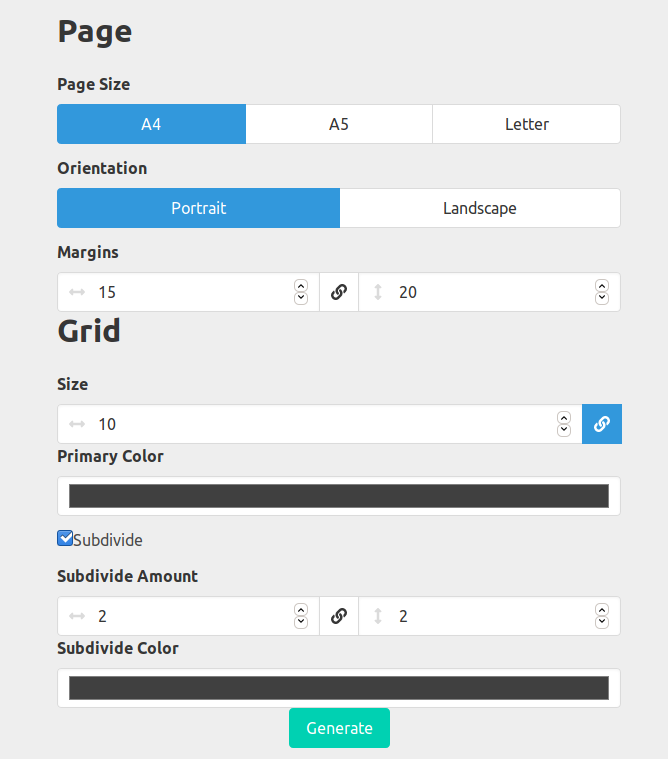

A personalized graphpaper generator.
I created this for personal use, but it is somewhat usable enough to share.

Orientation is remnant of a older project creates no difference.

CSS framework used is [bulma.io](https://bulma.io/)

Tested on `npm 5.8.0` and `nodejs 10.15.2`.

To use either download repository through github or clone it as below

```

git clone git@github.com:abdullahcanakci/pdf_graphpaper.git
cd pdf_graphpaper
cd frontend
npm install

cd ..
cd backend
npm install

mkdir static
mkdir static/pdf

npm run build
npm start

```


There are minimal failsafes in place, please don't try to break it ;)
